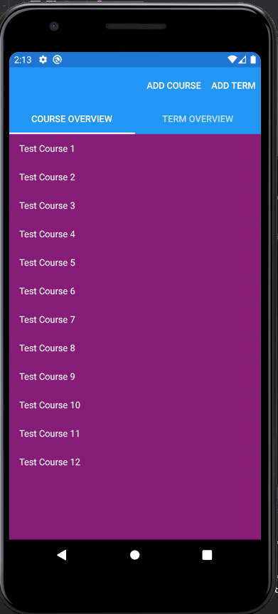
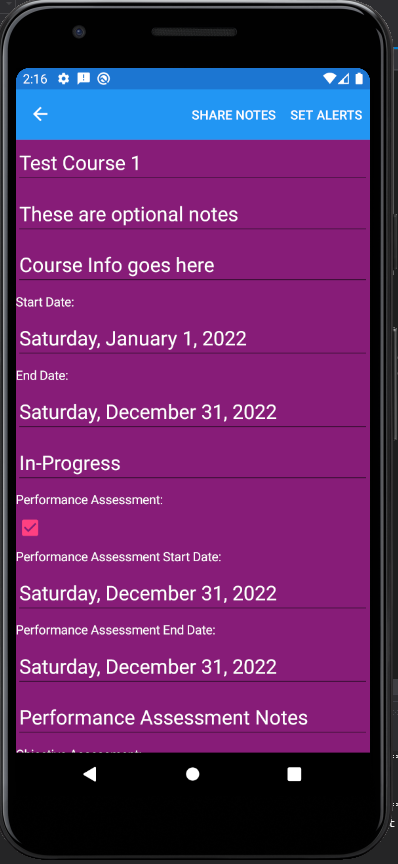
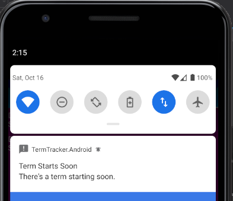
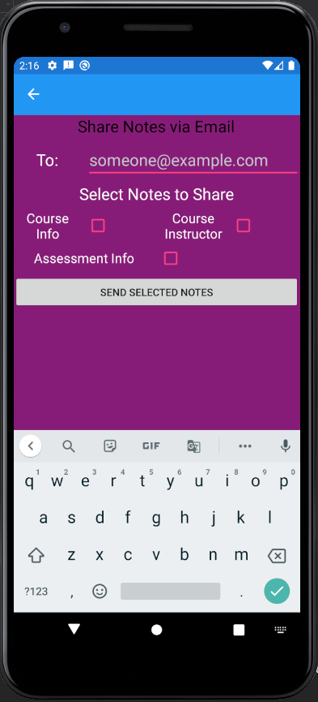
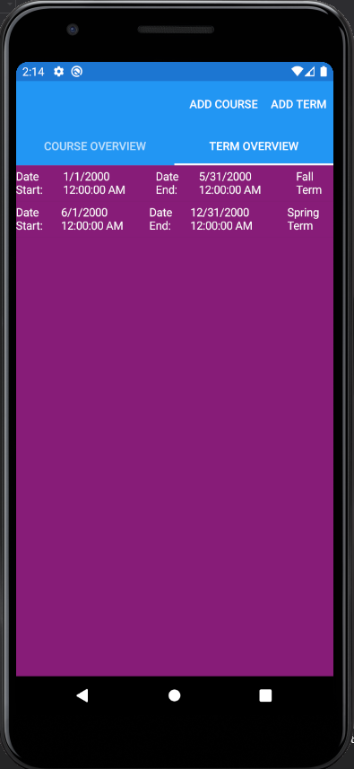
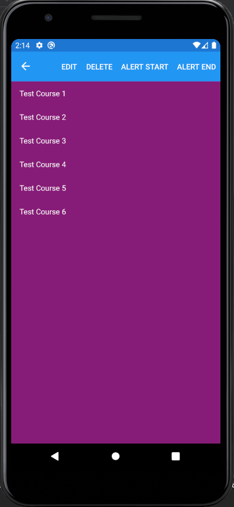

# TermTracker
Mobile app, developed with Xamarin. Available in iOS and Android.

I created a course and term tracker with Xamarin. It comes pre-seeded with example courses and terms. The ability to update, delete, and add any course, or term. Push notifications are able to be set for the start and end of a term, as well as any upcoming exams. You can also output the course notes via email. All data is bound and is updated as soon as you create the new course or term. The database is using SQLite and is persistant between app sessions. 

The page the user is greeted with upon opening the page. From here you can add a new course or term, or select one of the courses or terms and modify any of the information inside.

Some of the fields that the user can modify. There is data validation so the user can not set an exam in the past for example.

How a push notification would be displayed to the user.

Here the user can send some of the course information to an email address.

The term overview page.

When you select a term you will see all of the courses associated with it.

